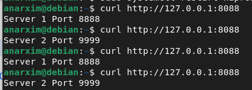
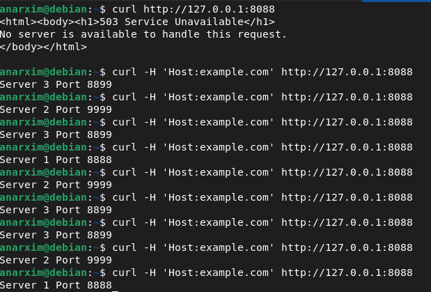

### Задание 1
1. Запустите два простых Python-сервера на своей виртуальной машине на разных портах.
2. Установите и настройте HAProxy, воспользуйтесь материалами к лекции по ссылке.
3. Настройте балансировку Round-robin на 4 уровне.
4. На проверку направьте конфигурационный файл HAProxy, скриншоты, где видно перенаправление запросов на разные серверы при обращении к HAProxy.

#### Решение 1
[haproxy1](./haproxy/haproxy 1.cfg)

---

### Задание 2
1. Запустите три простых Python-сервера на своей виртуальной машине на разных портах.
2. Настройте балансировку Weighted Round Robin на 7 уровне, чтобы первый сервер имел вес 2, второй — вес 3, а третий — вес 4.
3. HAProxy должен балансировать только тот HTTP-трафик, который адресован домену example.local.
4. На проверку направьте конфигурационный файл HAProxy, скриншоты, где видно перенаправление запросов на разные серверы при обращении к HAProxy с использованием домена example.local и без него.

#### Решение 2
[haproxy2](./haproxy/haproxy 2.cfg)

